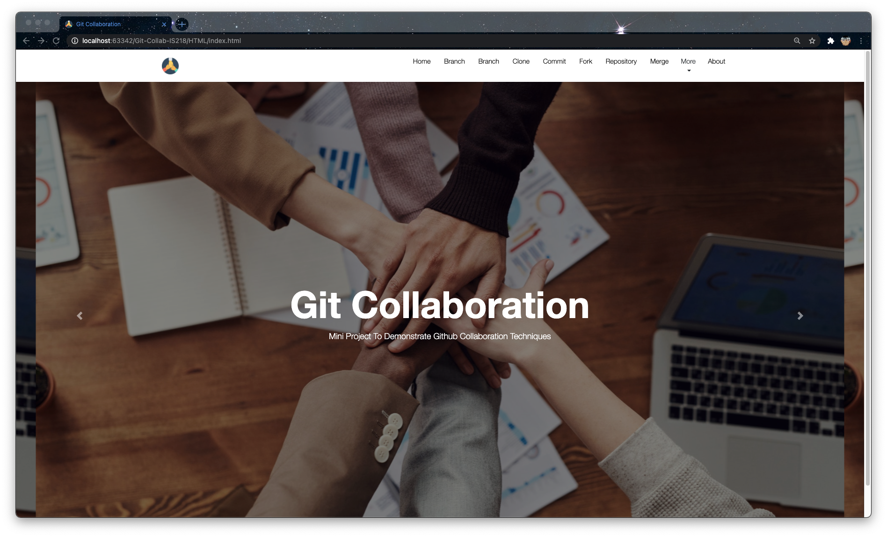

# Git Collaboration

## Lennart Lewis  - lhl7@njit.edu 
## Franklin Tan - fjt7@njit.edu

## INDEX
1. [Automation](HTML/Automation.html)
1. [Branching](HTML/Branch.html)
1. [Checkout](HTML/Checkout.html)   
1. [Cloning](HTML/Clone.html)
1. [Commit](HTML/Commit.html)
1. [Fork](HTML/Fork.html)
1. [Master](HTML/Master.html)
1. [Merge](HTML/Merge.html)
1. [Pull](HTML/Pull.html)   
1. [Push](HTML/Push.html)
1. [Remote](HTML/Remote.html)   
1. [Repository](HTML/Repository.html)
1. [Status](HTML/Status.html)

Added Files for Branch, Clone, Commit, Fork, Merge, and Repository - Franklin Tan

## Tutorials
1. [Git & GitHub Crash Course For Beginners](https://www.youtube.com/watch?v=SWYqp7iY_Tc&t=1312s)

## Changelog
[1.0] - 2021-01-30

Added Files for Branch, Clone, Commit, Fork, Merge, and Repository - Franklin Tan

[2.0] - 2021-01-30
Added HTML Template - Lennart Lewis

[2.1] - 2021-02-01

Changed md files to html for Branch, Clone, Commit, Fork, Merge, and Repository - Franklin Tan

[2.2] - 2021-02-01

Added Index and Tutorial section to ReadMe.md - Franklin Tan

[2.2] - 2021-02-03

Added Automation, Docker, Checkout, Master, Pull, Push, Remote and Status pages - Lennart Lewis 

[2.3] 2021-02-03

Updated README file index and changelog file - Lennart Lewis 